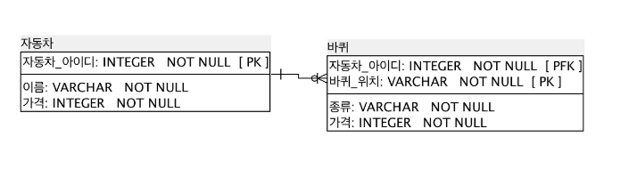

# 식별관계

부모 테이블의 PK나 UNIQUE KEY를<br/>
자식 테이블이 PK로 가지는 것.

~~즉, 자식 데이터는 부모 없이 생길 수 없다.~~

따라서, `Foreign Key가 nullable 할 수 없다.`

또한, PK는 반드시 들어가야 하는데, FK이기까지 하므로,

참조 무결성 제약 조건을 지키는 선에서 데이터가 INSERT 되어야 하므로

자식 데이터는 부모 데이터가 반드시 존재해야 한다.

```
Referential integrity constraint violation

참조 무결성 제약 조건을 해쳤다는 뜻인데,

FK 값에 참조할 수 없는 값이 INSERT 되었다는 뜻이다.
```

요약하면, 부모 테이블을 가르키는 FK를 자식이 PK로 사용한다.



# 비식별관계

자식 테이블의 FK를 자식이 PK로 사용하지 않는다.

따라서, `FK는 Nullable이다.`