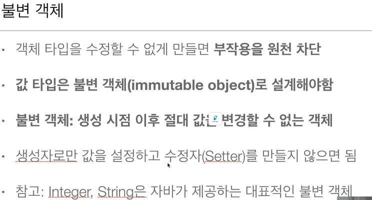

# @Embedded를 권장하는 Hibernate 공식문서의 그림


내가 만든 코드에선 PhoneNumber를 Contact(Embeddable)와 PhoneEntity를 Phone(Entity)로

구현하였다.

# @Embedded를 사용할 때 공유참조를 주의



그에따라 @Embeddable 클래스는 Setter를 주어지게 하지 않는다.

단, 그 @Embeddable 클래스의 부모클래스(컴포지션의 부모 클래스)가 setter를 통해

다음과 같이 작업하도록 유도한다.


```java

// 나쁜 케이스
phoneNumber.setNumber(123);

// 좋은 케이스
member.setPhoneNumber(new PhoneNumber(123));

```

# 값 타입 컬렉션을 이용하는 별 다른 방법은 존재하지 않는다.

이는 곧 @OneToMany와 같은 형식을 이용한다는것인데.

개인적인 생각으로 비정규화 테이블에서 좀 사용할 여지가 발생하지 않을까 예상 해 본다.