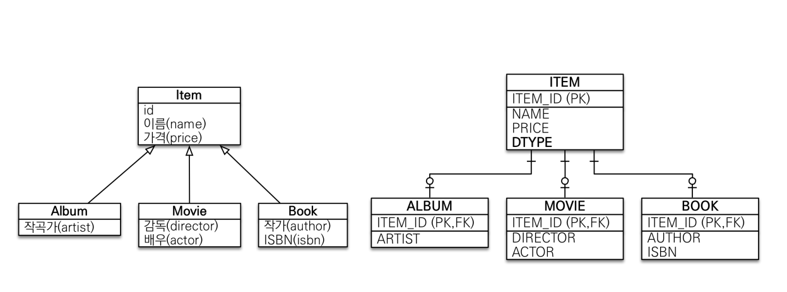
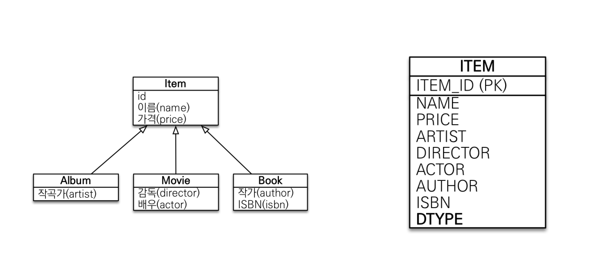
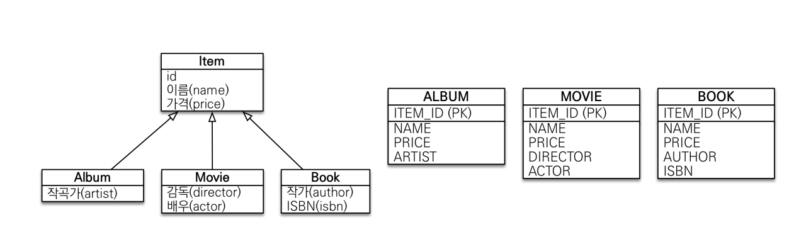

# 상속관계 매핑

## JPA 기본전략
JPA는 기본전략으로 `2.한테이블에 모든 데이터 몰아넣기`를 사용

# History

관계형 데이터베이스엔 상속관계가 없다.

관계형 데이터베이스에서도 객체지향에서의 상속을 구현한 로직이 있는데,

이는 `슈퍼타입 서브타입` 이다.

`슈퍼타입 서브타입` 은 RDB 세상에서의 `상속`이다.

`슈퍼타입 서브타입`은 관계형 데이터베이스에서의 논리적(=Virtual) 모델이다.

따라서, 이 논리적 모델을 구현해야 하는데, 이 구현체에는 3가지 종류가 있다.

### 각각 테이블로 변환

해당 물리적 모델은 Join으로 구현한다.

### 통합 테이블로 변환

해당 물리적 모델은 단일 테이블을 호출하면 된다.

### 서브타입 테이블로 변환

해당 물리적 모델또한 마찬가지로 그냥 호출하면 된다.

---

## 김영한은 어떻게 하는지

너무 간단한 비즈니스 모델, 즉 각 Album, Movie, Book 등이 가진 데이터가 그렇게 많지 않을땐 `통합 테이블`을 사용한다

그 외에는 기본적으로 `Join 모델` 을 이용한다.

## 근데 대체 언제 채택함?

A ⊂ B 일 때, B는 서브타입, A는 슈퍼타입이다.

OneToOne 즉, 1:1 관계로 Composition을 두는것과의 차이는 포함관계냐 아니냐 라는것이다.

Member가 MemberDetail을 가지고 있을때, MemberDetail과 Member는 서로 포함관계가 아니다.

따라서, 포함관계가 존재하며 `다형적`인 데이터 모델링이 필요할때 고려한다.

